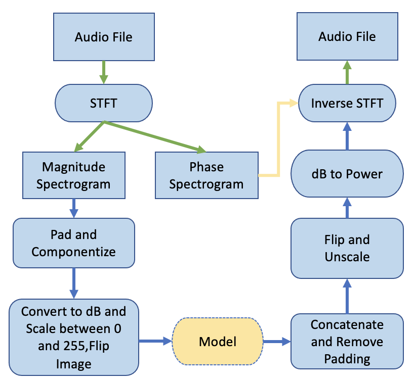

# AudioApp - Real-time Audio Processing for Android

A sophisticated Android application focused on high-quality, low-latency audio processing with support for Bluetooth devices.


## Overview

AudioApp is a cutting-edge Android application that provides real-time audio processing capabilities, including noise reduction, voice activity detection, and FFT-based audio analysis. The app is optimized for low-latency audio performance, with special attention to Bluetooth device compatibility to deliver the best possible audio experience.

## Features

- **Real-time Audio Processing**: Capture, process, and play audio with minimal latency
- **FFT-based Audio Analysis**: Visualize audio frequencies in real-time
- **Voice Activity Detection (VAD)**: Intelligent detection of human speech
- **Noise Reduction**: Advanced algorithms to minimize background noise
- **Bluetooth Optimization**: Enhanced performance with Bluetooth audio devices
- **Audio Visualization**: Real-time visual representation of audio data
- **Modern UI**: Clean, intuitive interface using Jetpack Compose

## Architecture

The application follows the MVVM (Model-View-ViewModel) architecture pattern to ensure clean separation of concerns and maintainable code.


### Components

1. **Model**: Contains data classes and repositories for audio data handling
2. **View**: UI components built with Jetpack Compose
3. **ViewModel**: Bridges the UI and data layers, handling business logic
4. **AudioProcessor**: Core component for audio signal processing
5. **BluetoothAudioManager**: Manages Bluetooth connections and optimizations
6. **AudioProcessingService**: Background service for continuous audio processing

## Technical Implementation

### Audio Processing Pipeline

The audio processing pipeline is designed to minimize latency while maximizing processing capabilities:

```
Audio Input → Buffer Management → FFT Analysis → 
Noise Reduction → VAD Processing → Visualization → Audio Output
```



### Bluetooth Optimizations

The app implements several strategies to optimize Bluetooth audio performance:

1. **Codec Selection**: Automatically selects the most appropriate codec based on device capabilities
2. **Buffer Management**: Dynamic buffer adjustment to balance latency and stability
3. **Connection Monitoring**: Proactive monitoring and management of Bluetooth connections
4. **Latency Compensation**: Algorithms to compensate for Bluetooth audio latency
5. **Power Optimization**: Smart power management to extend battery life


### Low-latency Audio Implementation

To achieve the lowest possible latency, the app utilizes:

- Native code (C/C++) via JNI for core audio processing
- OpenSL ES and AAudio APIs when available
- Optimized buffer sizes and sample rates
- Thread prioritization for audio processing
- Fast path audio routing when supported by the device

## Getting Started

### Prerequisites

- Android Studio Arctic Fox or later
- Android SDK 21 or higher
- A device running Android 5.0 (Lollipop) or higher
- Optional: Android device with Bluetooth A2DP support for best experience

### Building the Project

1. Clone the repository:
   ```bash
   git clone https://github.com/GeraldWambui/AudioApp.git
   ```

2. Open the project in Android Studio

3. Build the project:
   ```bash
   ./gradlew build
   ```

4. Run on a device or emulator:
   ```bash
   ./gradlew installDebug
   ```

## Usage

1. Launch the app and grant the necessary audio permissions
2. Connect your Bluetooth audio device if desired
3. Use the main interface to start audio processing
4. Adjust settings as needed for your environment
5. View real-time audio visualizations and processing metrics

## Dependencies

- Kotlin and Coroutines for asynchronous programming
- Jetpack Compose for modern UI
- AAPT for audio visualization
- TensorFlow Lite for VAD model
- AndroidX libraries for app architecture components

## Contributing

Contributions are welcome! Please feel free to submit a Pull Request.

1. Fork the repository
2. Create your feature branch (`git checkout -b feature/amazing-feature`)
3. Commit your changes (`git commit -m 'Add some amazing feature'`)
4. Push to the branch (`git push origin feature/amazing-feature`)
5. Open a Pull Request

## License

This project is licensed under the [MIT License](LICENSE) © 2025 GeraldWambui.

## Acknowledgments

- Google's Audio Latency documentation for Android
- The TensorFlow team for the VAD models
- The Android Audio community for sharing insights on low-latency audio processing 